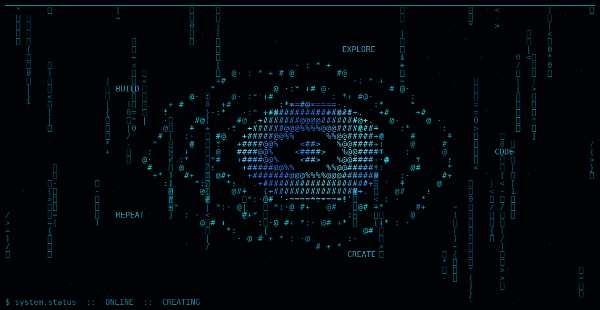

<p align="center">  </p>

# 👨‍💻 About Me

I'm **Aswin P M**, an Integrated MSc Computer Science student specializing in **AI & Data Science at DCS-CUSAT**. I enjoy building software, experimenting with AI and data, developing web applications, and exploring the creative side of technology.

I'm someone who learns by **building, experimenting, breaking things, and figuring out how to make them better**.

---

# 🎓 Education

**Integrated MSc Computer Science — AI & Data Science**
📍 Department of Computer Science, CUSAT
🎓 Currently pursuing

---

# 💼 Experience

### 🔹 Software & Web Development

Experience building full-stack and frontend applications, working with authentication, APIs, databases, maps, deployment, and responsive user interfaces.

### 🔹 AI & Data Science

Hands-on experience experimenting with machine learning and deep learning workflows, datasets, embeddings, model architectures, and AI-powered applications.

### 🔹 Research & Experimentation

Exploring research-oriented problems in areas such as **deep learning, representation learning, NLP, molecular/protein embeddings, and model experimentation**.

### 🔹 Creative Technology

Experience combining programming with visual and multimedia work, including **generative graphics, animation, image editing, video processing, and interactive UI design**.

---

# 🛠️ Tech Stack

### 💻 Languages

<p align="center">
  
  
  
  
  
  
</p>

### 🌐 Web & Frameworks

<p align="center">
  
  
  
  
  
  
  
  
</p>

### 🤖 AI / ML / Data

<p align="center">
  
  
  
  
</p>

### 🗄️ Databases & Backend

<p align="center">
  
  
  
</p>

### ⚙️ Tools & Platforms

<p align="center">
  
  
  
  
</p>

---

# 🎨 Creative Skills

* Photography & photo editing
* Video editing
* Motion graphics
* Generative visuals
* Programmatic graphics
* Interactive UI design
* Canvas experiments
* Multimedia processing

**Tools:** Lightroom • Lightroom Classic • After Effects • Premiere Pro • Canva • FFmpeg

---

# 🚀 Featured Projects

| Project             | Description                                                                            | Technologies             |
| ------------------- | -------------------------------------------------------------------------------------- | ------------------------ |
| **HIPM_DTA**        | Drug–target affinity research and deep-learning experimentation                        | Python, PyTorch, Jupyter |
| **ChaiMap**         | Map-based tea-shop discovery platform with live contextual information                 | React, Leaflet, Supabase |
| **JobEasy**         | Services marketplace with authentication, storage, security and backend infrastructure | React, Express, MongoDB  |
| **Malayalam → SQL** | Natural-language-to-SQL system for Malayalam queries                                   | Python, SQLite           |
| **CineTix**         | Desktop movie ticket-booking application                                               | Java, Swing              |

---

# 🌱 Currently Learning

```text
Artificial Intelligence
Deep Learning
Natural Language Processing
Data Science
Full-Stack Development
System Design
Generative & Creative Technology
```

---

# 🎯 Areas of Interest

**AI & Machine Learning**
**Data Science & Analytics**
**Software Engineering**
**Web Development**
**NLP & Language Technologies**
**Generative Technology**
**Creative Coding**
**Product Development**

---

# 📊 GitHub Stats

<p align="center">
  
  
</p>

<p align="center">
  
</p>

---

# 🌐 Connect

<p align="center">

<a href="https://github.com/aswinpm-ofc">

</a>

<a href="https://www.linkedin.com/in/aswinpm-ofc/">

</a>

<a href="mailto:aswinpmofc@gmail.com">

</a>

<a href="https://instagram.com/_.a.swin._">

</a>

</p>

---

<div align="center">

⭐ **From chai stalls to code, ideas, and experiments.**

`CODE` • `CREATE` • `EXPLORE` • `REPEAT`

</div>
